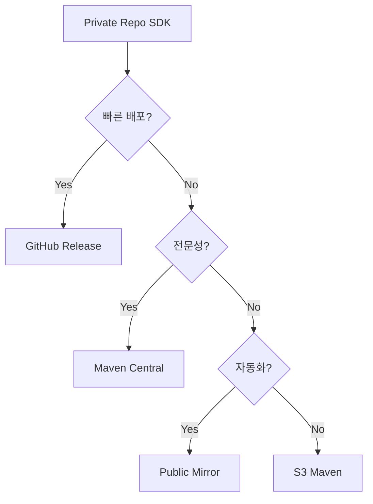

# 🚀 Private Repo → Public SDK 배포 가이드

## 📋 배포 옵션 비교

| 방법 | 난이도 | 비용 | 파트너 편의성 | 추천도 |
|------|--------|------|--------------|--------|
| **Maven Central** | ⭐⭐⭐ | 무료 | ⭐⭐⭐⭐⭐ | 🥇 |
| **GitHub Release CDN** | ⭐ | 무료 | ⭐⭐⭐ | 🥈 |
| **AWS S3 Maven** | ⭐⭐ | 유료 | ⭐⭐⭐⭐ | 🥉 |
| **JitPack Public Mirror** | ⭐ | 무료 | ⭐⭐⭐⭐ | 🏅 |

---

## 🥇 방법 1: Maven Central (추천)

### 초기 설정 (한 번만)
1. **Sonatype 계정 생성**: https://issues.sonatype.org
2. **Group ID 신청**: `io.github.1selfworld-labs` 
3. **GPG 키 생성**: 
   ```bash
   gpg --gen-key
   gpg --export-secret-keys -o secring.gpg
   ```

### 배포 프로세스
```bash
# 1. 버전 설정
echo "SDK_VERSION=1.0.0" >> gradle.properties

# 2. 배포
./gradlew publishReleasePublicationToSonatypeRepository

# 3. Release (수동)
# https://s01.oss.sonatype.org 에서 Close & Release
```

### 파트너사 사용법
```kotlin
// 토큰 불필요! 바로 사용!
dependencies {
    implementation("io.github.1selfworld-labs:adchain-sdk:1.0.0")
}
```

---

## 🥈 방법 2: GitHub Release CDN (가장 간단)

### 배포 프로세스
```bash
# 1. Release 파일 생성
./gradlew createPublicRelease

# 2. GitHub Release 생성
gh release create v1.0.0 \
  build/releases/adchain-sdk-1.0.0.aar \
  build/releases/adchain-sdk-1.0.0.pom \
  --title "Release v1.0.0" \
  --notes "SDK Release"
```

### 파트너사 사용법
```kotlin
// build.gradle.kts
repositories {
    maven {
        url = uri("https://github.com/1selfworld-labs/adchain-sdk-android/releases/download/")
    }
}

dependencies {
    implementation("com.adchain.sdk:adchain-sdk:1.0.0")
}
```

또는 직접 다운로드:
```kotlin
dependencies {
    implementation(files("libs/adchain-sdk-1.0.0.aar"))
    // 의존성은 POM 파일 참조
}
```

---

## 🥉 방법 3: AWS S3 Maven Repository

### S3 설정
```bash
# S3 버킷 생성
aws s3 mb s3://adchain-sdk-maven

# Public 읽기 권한 설정
aws s3api put-bucket-policy --bucket adchain-sdk-maven \
  --policy file://bucket-policy.json

# CloudFront 배포 (선택사항)
aws cloudfront create-distribution \
  --origin-domain-name adchain-sdk-maven.s3.amazonaws.com
```

### 배포
```kotlin
// build.gradle.kts
publishing {
    repositories {
        maven {
            url = uri("s3://adchain-sdk-maven/releases")
            authentication {
                create<AwsImAuthentication>("awsIm")
            }
        }
    }
}
```

### 파트너사 사용법
```kotlin
repositories {
    maven {
        url = uri("https://adchain-sdk-maven.s3.amazonaws.com/releases")
    }
}

dependencies {
    implementation("com.adchain.sdk:adchain-sdk:1.0.0")
}
```

---

## 🏅 방법 4: JitPack Public Mirror

### Private → Public 미러링
1. **Public 미러 저장소 생성**: `adchain-sdk-android-public`
2. **GitHub Action으로 자동 동기화**:

```yaml
# .github/workflows/mirror-public.yml
name: Mirror to Public

on:
  release:
    types: [published]

jobs:
  mirror:
    runs-on: ubuntu-latest
    steps:
      - uses: actions/checkout@v3
      
      - name: Build AAR
        run: ./gradlew assembleRelease
      
      - name: Push to Public Mirror
        run: |
          git clone https://github.com/1selfworld-labs/adchain-sdk-android-public.git
          cp -r build/outputs/aar/* adchain-sdk-android-public/
          cd adchain-sdk-android-public
          git add .
          git commit -m "Release ${{ github.event.release.tag_name }}"
          git push
```

### 파트너사 사용법
```kotlin
// Public mirror 사용 - 토큰 불필요!
dependencies {
    implementation("com.github.1selfworld-labs:adchain-sdk-android-public:1.0.0")
}
```

---

## 💡 추천 시나리오

### 🎯 "빠르게 시작하고 싶어요"
→ **GitHub Release CDN** 사용
- 설정 5분
- 바로 배포 가능
- URL 직접 제공

### 🎯 "전문적으로 배포하고 싶어요"
→ **Maven Central** 사용
- 초기 설정 필요
- 가장 표준적인 방법
- 파트너사 편의 최고

### 🎯 "자동화하고 싶어요"
→ **JitPack Public Mirror** 사용
- GitHub Action 자동화
- Private 소스 보호
- Public 배포 자동화

---

## 📊 의사결정 플로우



---

## ✅ 체크리스트

### Maven Central 선택시
- [ ] Sonatype 계정 생성
- [ ] Group ID 승인
- [ ] GPG 키 설정
- [ ] gradle 설정
- [ ] 첫 배포 테스트

### GitHub Release 선택시
- [ ] Release 스크립트 작성
- [ ] AAR + POM 생성
- [ ] GitHub Release 생성
- [ ] 다운로드 URL 테스트

### Public Mirror 선택시
- [ ] Public repo 생성
- [ ] GitHub Action 설정
- [ ] 자동 동기화 테스트
- [ ] JitPack 빌드 확인

---

## 🚀 Quick Start

가장 빠른 방법 (10분):
```bash
# 1. AAR 빌드
./gradlew assembleRelease

# 2. GitHub Release 생성
gh release create v1.0.0 \
  adchain-sdk/build/outputs/aar/adchain-sdk-release.aar \
  --title "SDK v1.0.0"

# 3. 파트너에게 전달
"다운로드: https://github.com/1selfworld-labs/adchain-sdk-android/releases/download/v1.0.0/adchain-sdk-release.aar"
```